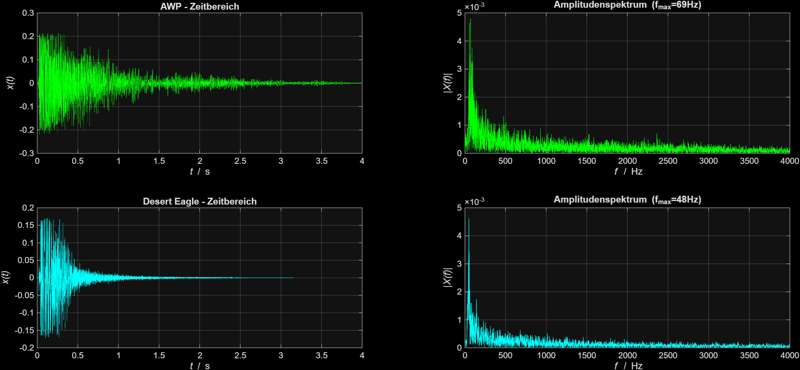

# cs2-audio-classifier

Herzlich willkommen zu meinem Projekt aus den Sommersemesterferien 26!

Dieses Projekt analysiert und klassifiziert Schussgeräusche aus dem Spiel *Counter-Strike 2* mittels digitaler Signalverarbeitung in MATLAB.

> Disclaimer: Dieses Projekt dient ausschließlich zu Bildungs- und Forschungszwecken im Rahmen der digitalen Signalverarbeitung und Mustererkennung. Alle analysierten Audiodaten stammen aus dem Videospiel Counter-Strike 2 und stehen in keinerlei Zusammenhang mit realer Waffentechnik oder Rüstungsforschung.

**Reicht die Fast Fourier Transformation (FFT) aus, um Waffensounds in CS2 treffsicher zu unterscheiden?**
Das finden wir nun heraus! :)

Das Projekt teilt sich in zwei Schritte auf:
1. **Audio-Analyse:** Untersuchung der Schussgeräusche im Zeit- und Frequenzbereich (FFT).
2. **Klassifikation:** Automatisierte Erkennung unbekannter Schüsse anhand der extrahierten Merkmale (kommt noch).

## Teil 1: Audio-Analyse (Zeit- & Frequenzbereich)
**Zeitbereich x(t)**: Zeigt den Schalldruckverlauf über die Zeitachse. Hier sieht man, wie hart der Schuss einschlägt und wie lange der Schall im Raum nachhallt.

**Frequenzbereich mit FFT**: Zerlegt den Sound in Bestandteile von Bass (0 Hz) bis zu den Höhen (4000 Hz). Die Peaks im Plot markieren die dominanten Töne der Waffe.

- *AK-47* (Peak = 127 Hz): Der ungedämpfte Schuss startet mit einer hohen Anfangsamplitude und verteilt seine Energie breit über den Bereich bis 1000 Hz. Die kleinen Anstiege im mittleren Bereich (2000 - 3000 Hz) tragen dazu bei, dass die Waffe einen aggresiven metallisch scheppernden Sound hat.
- *M4A1-S* (Peak = 76 Hz): Auffällig ist bei diesem Sturmgewehr die extrem kurze Signaldauer. Im Zeitbereich ist nach knapp 0,3s das Signal abgeklungen. Im Amplitudenspektrum werden alle Anteile oberhalb von 500 Hz durch den Schalldämpfer unterdrückt.
  
- *AWP* (Peak = 69 Hz): Hier wird die enorme Energie des Schusses deutlich sichtbar. Das Scharfschützengewehr dominiert beide Diagramme. Im Zeitbereich erzeugt der Schuss eine lange Nachhalldauer. Der Peak bei 69 Hz ist mit einer Amplitude von fast 0,005 extrem hoch und der Ton somit im Vergleich zu allen anderen Waffen mit Abstand am stärksten ausgeprägt.
- *Desert Eagle* (Peak = 48 Hz): Liefert den tiefsten Peak im gesamten Vergleich und schwingt über 1,5s aus. Durch die vielen Mittenanteile im Amplitudenspektrum erzeugt die Deagle einen harten metallischen Knall.
  

  
